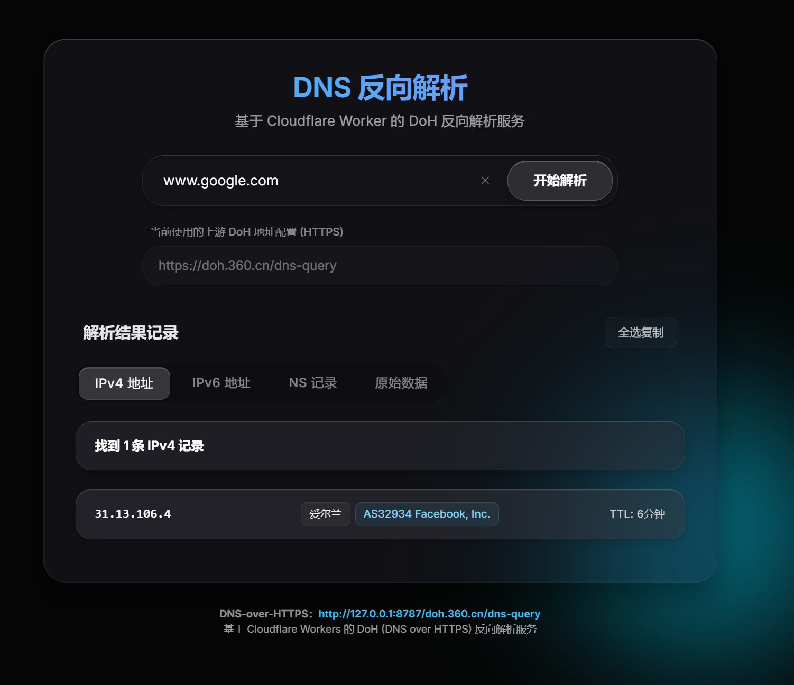

# DNS-over-HTTPS Worker


一个轻量级、高性能的 DNS-over-HTTPS (DoH) 代理服务，基于 Cloudflare Workers 构建。支持自定义上游 DNS 服务器、Token 认证、IP 地理位置查询等功能。

## 📸 界面预览



## ✨ 功能特性

| 特性 | 描述 |
|------|------|
| 🔐 **DoH 代理** | 标准 DNS-over-HTTPS 协议，支持 GET/POST 请求 |
| 🔄 **自定义上游** | 通过 URL 路径动态切换 DoH 服务器 |
| 🌐 **Web UI** | 支持多种记录类型查询 |
| 🔑 **Token 认证** | 支持Token认证保护接口  |
| 📍 **IP 查询** | IP 地理位置信息查询接口 |
| 🎭 **主页伪装** | 支持重定向或伪装为 nginx 欢迎页 |

## 🚀 快速部署

### 一键部署

[](https://deploy.workers.cloudflare.com/?url=https://github.com/Yuch3nE/dns-reverse-cf-worker)

### 手动部署

1. 登录 [Cloudflare Dashboard](https://dash.cloudflare.com/)
2. 进入 **Workers & Pages** → **Create Application** → **Create Worker**
3. 将 [worker.js](worker.js) 代码粘贴到编辑器
4. 配置环境变量（见下方说明）
5. 点击 **Deploy** 部署

## ⚙️ 配置说明

### 环境变量

| 变量名 | 必填 | 默认值 | 说明 |
|--------|:----:|--------|------|
| `DOH` | 否 | `cloudflare-dns.com` | 默认 DoH 服务器地址 |
| `PATH` | 否 | `dns-query` | DoH 端点路径 |
| `TOKEN` | 否 | - | 访问令牌，设置后启用认证保护 |
| `URL302` | 否 | - | 重定向地址，设置后所有请求 302 跳转 |
| `URL` | 否 | - | 伪装地址，设为 `nginx` 显示欢迎页 |

### 配置示例

**wrangler.toml**
```toml
name = "dns-doh-worker"
main = "worker.js"

[vars]
DOH = "cloudflare-dns.com"
PATH = "dns-query"
TOKEN = "your-secret-token"
```

## 📖 使用指南

### 基本用法

**默认 DoH 端点**
```
https://your-worker.workers.dev/dns-query
```

**指定上游 DNS 服务器**
```
https://your-worker.workers.dev/dns.google/dns-query
```

### Token 认证

设置 `TOKEN` 环境变量后，可通过以下方式认证：

| 方式 | 示例 |
|------|------|
| URL 路径 | `https://worker.dev/{token}/dns-query` |

> 💡 **提示**: 浏览器访问带 Token 的 URL 会自动设置 Cookie，后续访问无需携带 Token。

### Web UI 查询

**使用默认 DoH**
```
https://your-worker.workers.dev/dns-query?domain=www.google.com&type=all
```

**使用自定义 DoH**
```
https://your-worker.workers.dev/dns.google/dns-query?domain=www.google.com&type=all
```

### 在AdGuard Home中配置

```
https://your-worker.workers.dev/dns-query
```

**带 Token 认证**
```
https://your-worker.workers.dev/{token}/dns-query
```

# 使用 doggo
``` bash
doggo www.google.com A @https://your-worker.workers.dev/dns-query
```

## 🌍 支持的 DoH 服务器

| 服务器 | 供应商 | 区域 | 推荐 |
|--------|--------|:----:|:----:|
| `cloudflare-dns.com` | Cloudflare | 🌍 | ✅ |
| `dns.google` | Google | 🌍 | ✅ |
| `dns.quad9.net` | Quad9 (IBM) | 🌍 | |
| `doh.opendns.com` | OpenDNS (Cisco) | 🌍 | |
| `dns.alidns.com` | 阿里 DNS | 🇨🇳 | |
| `doh.360.cn` | 360 DNS | 🇨🇳 | ✅ |
| `doh.pub` | 腾讯 DNSPod | 🇨🇳 | ⚠️ |

## 🔌 API 接口

### DNS 查询

**GET 请求**
```
GET /dns-query?domain=www.google.com&type=all
```

### IP 地理位置查询

```
GET /ip-info?ip=8.8.8.8
```

**响应示例**
```json
{
  "status": "success",
  "country": "美国",
  "countryCode": "US",
  "region": "VA",
  "regionName": "弗吉尼亚州",
  "city": "Ashburn",
  "zip": "20149",
  "lat": 39.03,
  "lon": -77.5,
  "timezone": "America/New_York",
  "isp": "Google LLC",
  "org": "Google Public DNS",
  "as": "AS15169 Google LLC",
  "query": "8.8.8.8"
}
```

## 📄 许可证

[MIT License](LICENSE)

## 🙏 鸣谢

- [cmliu/CF-Workers-DoH](https://github.com/cmliu/CF-Workers-DoH)
- [tina-hello/doh-cf-workers](https://github.com/tina-hello/doh-cf-workers)
- [ip-api.com](https://ip-api.com/)
- [Cloudflare](https://www.cloudflare.com/)
